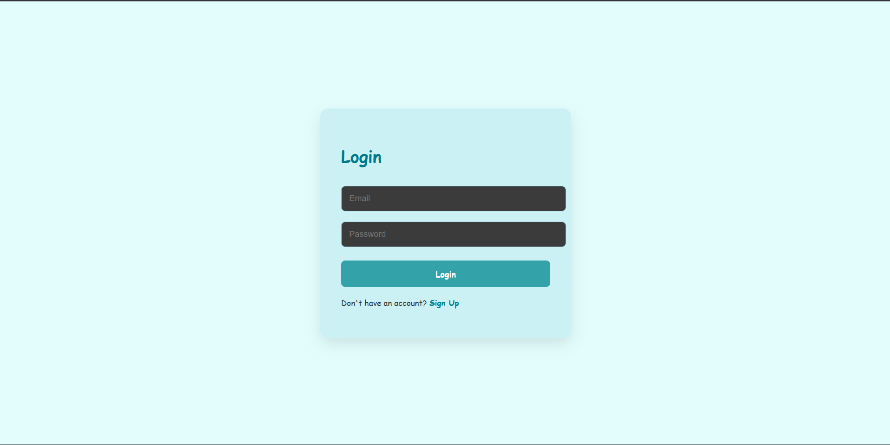
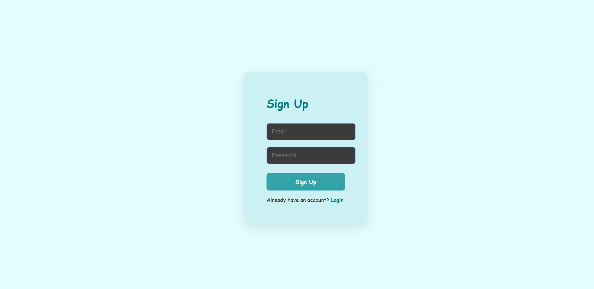
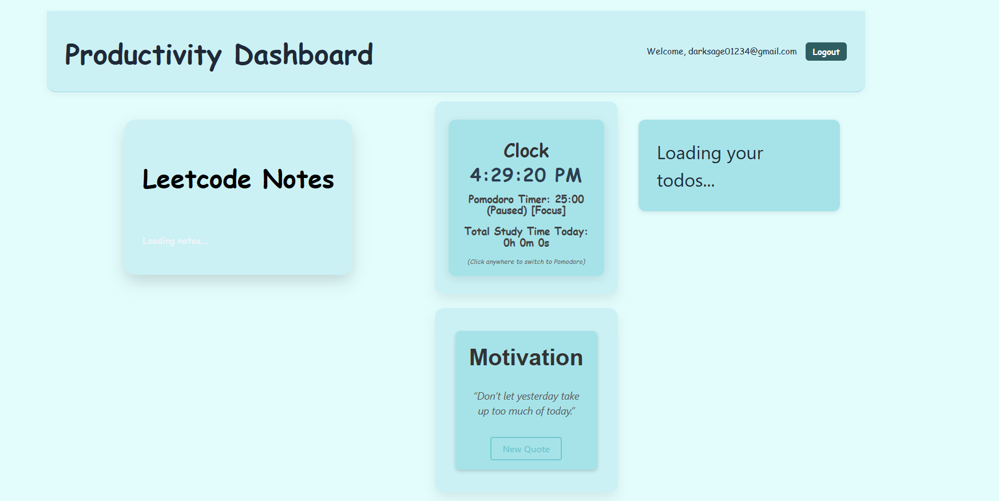
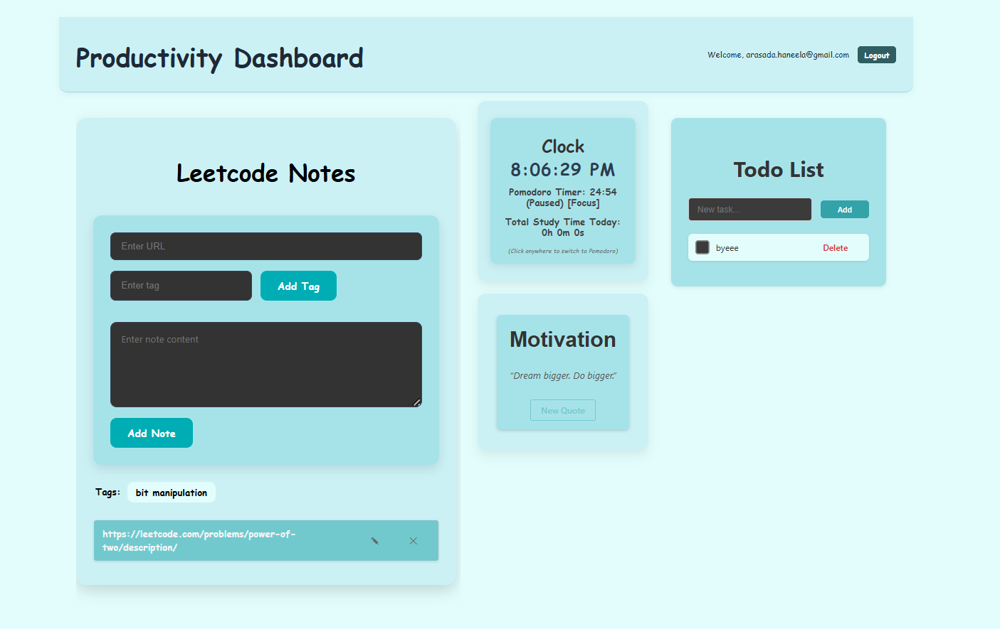
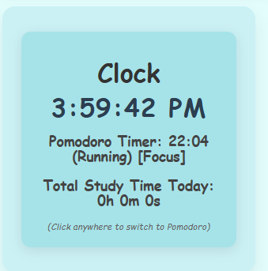
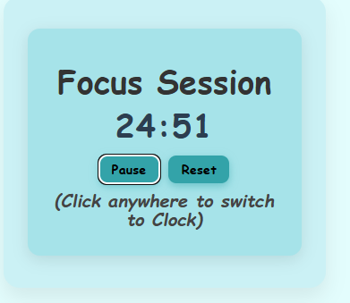
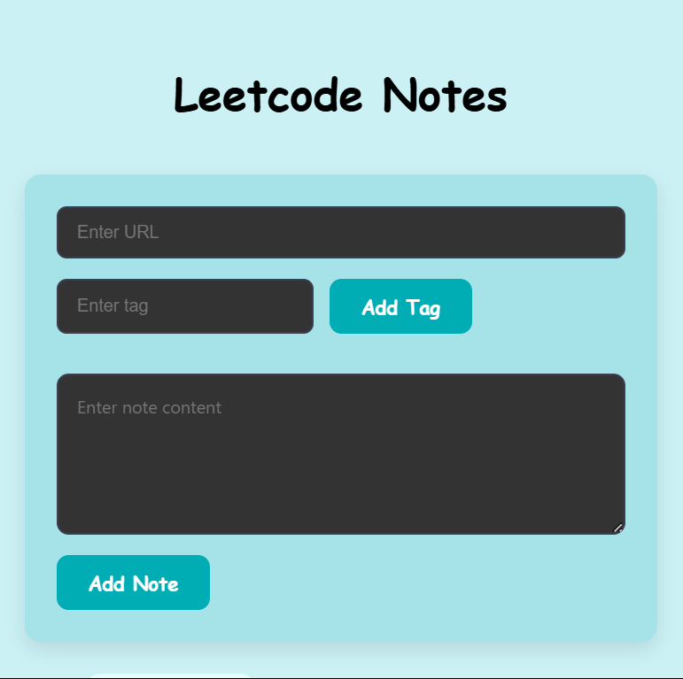
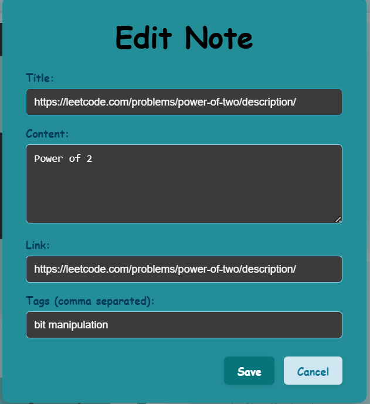
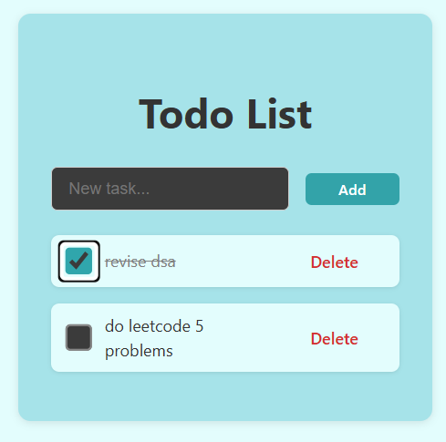
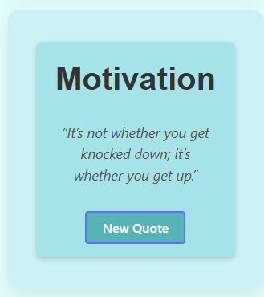

# leetcode-productivity-dashboard
This is a notes integrated productivity website that can be used for daily Leetcode prep. The ToDo can be used for task management which can be added, completer then deleted. The Pomodoro timer is used for Focussed 25 min sessions along with 5min break in between. All the sessions are tracked and total strudy time is displayed. The sessions can be paused and reset. It is a day-to-day tracker. The Leetcode Notes feature is very useful for segregating notes based on the topic tag. This can be used for revising all the previously solved questions. Multiple tags can be added and the question will be added under all the tags. The tags can be selected to display the questions, the notes card can be edited and deleted.Also the question link takes us to the website.The motivation widget displayes quotes for daily motivation. 

The Authentication is done by Firebase.
The backend is deployed on Render(free)
The frontend is deployed on Vercel
The database is MongoDB Atlas

**Login Page**

**Signup Page**

**Loading State**

**Dashboard**

**Components**
- **Clock**
    - **Time Display and Total Study time**
        
    - **Focus Session**
        
- **Leetcode Notes**
    - **Input**
        
    - **Note Card Expanded based on the selected Tag**
        
    - **Edit Notes**
        
- **Todo**
    
- **Motivation**
    
